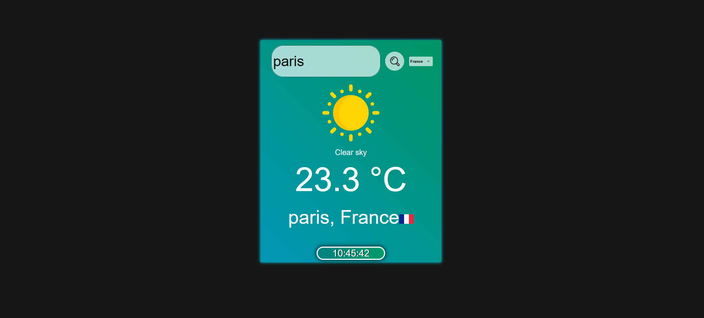

# 🌦️ Weather App with Real-Time Clock

A responsive weather application that fetches real-time weather data and displays the local time for any city worldwide. Built with HTML, CSS, and JavaScript, it integrates with the **OpenWeather API** and **IP Geolocation API** for accurate weather and timezone data.



## ✨ Features

* **Real-Time Weather Data**
   * Temperature (°C), weather conditions (e.g., "Partly cloudy"), and dynamic icons.
   * Supports all major cities globally.
* **Local Time Display**
   * Accurate clock synchronized with the selected city's timezone.
* **Country Flags**
   * Auto-populated dropdown with country flags for intuitive selection.
* **Error Handling**
   * Validates user input and displays friendly error messages.
* **Responsive Design**
   * Works on desktop and mobile devices.

## 🛠️ Technologies Used

* **Frontend**:
   * HTML5, CSS3, JavaScript (ES6+)
* **APIs**:
   * OpenWeather API (Weather data)
   * IP Geolocation API (Timezone data)
   * REST Countries API (Country flags and names)
* **Hosting**:
   * GitHub Pages (Optional)

## 🚀 Setup & Installation

### Prerequisites
* A free OpenWeather API key (Replace `apikey` in `script.js`).
* (Optional) An IP Geolocation API key for timezone lookup.

### Steps to Run Locally

1. **Clone the repository**:
   ```bash
   git clone https://github.com/yourusername/weather-app.git
   cd weather-app
   ```

2. **Replace API keys**: Edit `script.js` and update:
   ```javascript
   const apikey = 'YOUR_OPENWEATHER_API_KEY'; // Line 1
   const timezoneApiKey = 'YOUR_IPGEOLOCATION_API_KEY'; // Line 2 (if used)
   ```

3. **Open in browser**:
   * Launch `index.html` directly or use a live server (e.g., VS Code's Live Server).

## 🌍 How to Use

1. **Search for a city**:
   * Type a city name (e.g., "Tokyo").
   * Select a country from the dropdown (flags included!).
2. **View results**:
   * Weather details (temperature, description, icon).
   * Local time updates every second.

## 📂 Project Structure

```
weather-app/
├── index.html          # Main HTML file
├── script.js           # All JavaScript logic
├── styles.css          # Custom CSS
├── assets/             # (Optional) Folder for icons/images
└── README.md           # This file
```

## 🤝 Contributing

Contributions are welcome! Follow these steps:
1. Fork the project.
2. Create a branch (`git checkout -b feature/your-feature`).
3. Commit changes (`git commit -m 'Add your feature'`).
4. Push to the branch (`git push origin feature/your-feature`).
5. Open a Pull Request.

## 📜 License

This project is licensed under the **MIT License**. See LICENSE for details.

## 🙏 Credits

* Weather icons by OpenWeather.
* Country flags from Flagpedia.
